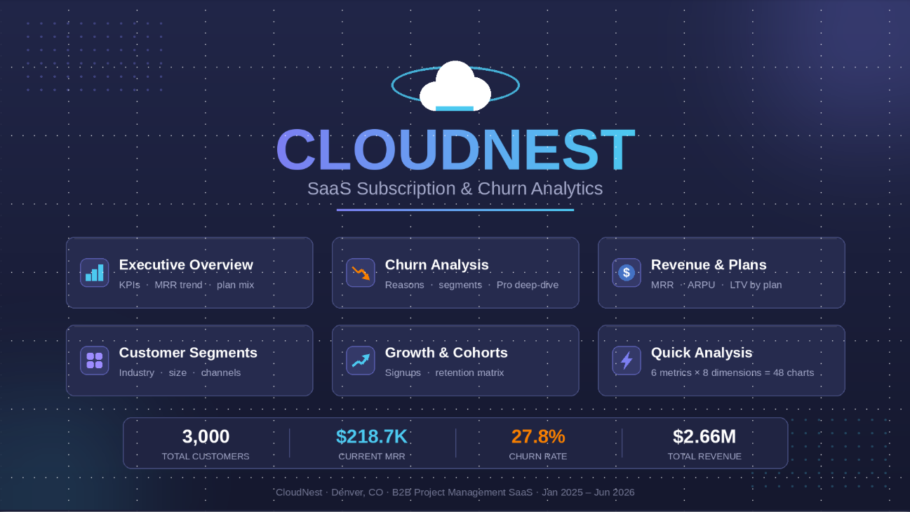
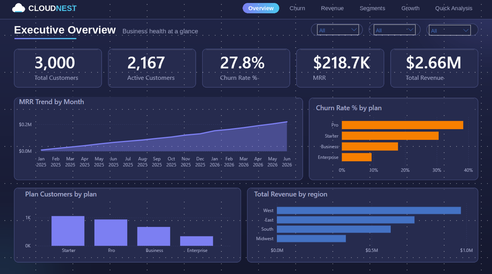
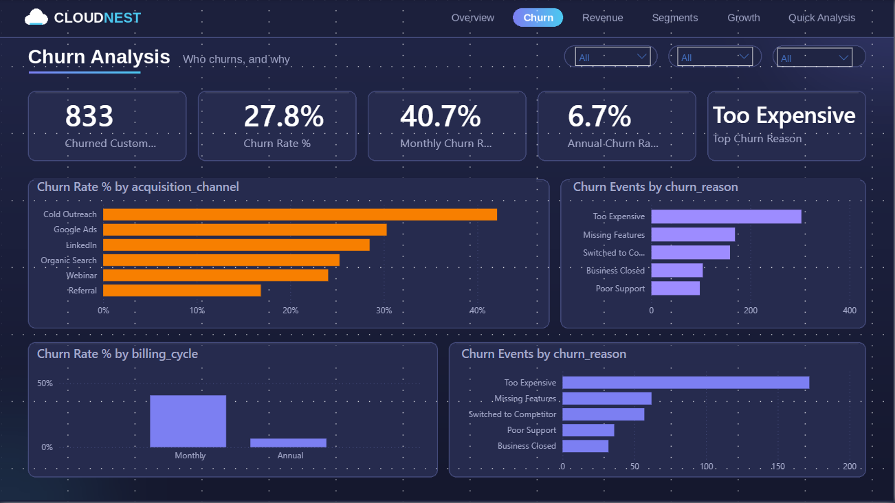
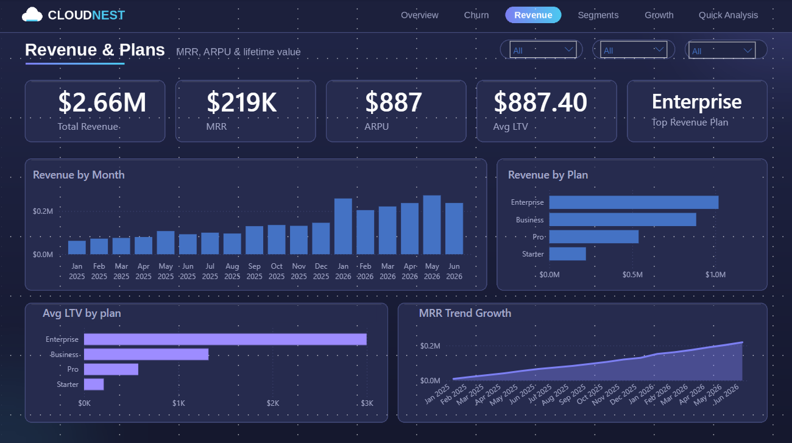
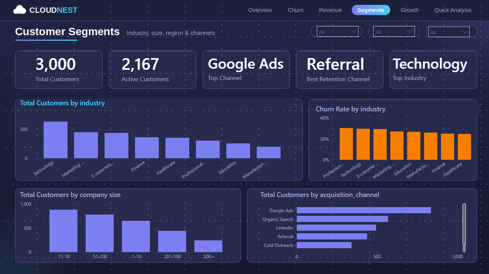
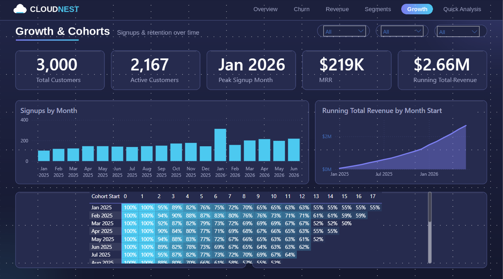
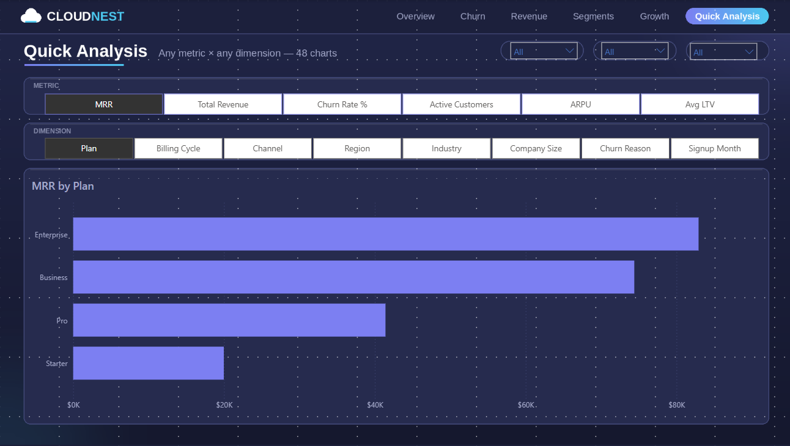

# CloudNest — SaaS Subscription & Churn Analytics ☁️



>  Self-Made Project   
> A full-pipeline analytics project CSV → PostgreSQL → Power BI  — analyzing subscriptions and churn for a B2B SaaS company. Covers 3,000 customers, 18 months of data, $2.66M total revenue, and a 7-page interactive dark-mode dashboard.

---

## 📌 Project Overview

CloudNest is a US-based B2B project-management SaaS company (Denver, CO). The business grew to 3,000 customers in 18 months — but  27.8% of them churned . This project builds the complete data pipeline to find where revenue is leaking and what the business should do about it: the dataset is designed and generated in  Python , loaded and analyzed in  PostgreSQL  (18 analytical queries), and visualized in a 7-page  Power BI  dashboard with a custom PowerPoint-designed background.

```
CSVs → PostgreSQL (schema + analysis) → Power BI (dashboard)
```

 Key business questions answered: 
- What is the churn rate, and which plans drive it?
- Does billing cycle (Monthly vs Annual) affect retention?
- Which acquisition channels bring loyal customers — and which bring churners?
- How do revenue and customer lifetime value differ across plans?
- How well do signup cohorts retain over 18 months?
- Why do customers leave (churn reasons)?

---

## 🛠️ Tools Used

| Tool | Purpose |
|------|---------|
|  PostgreSQL  | Relational schema (5 tables, PKs/FKs) + 18 analytical queries + 2 views 
|  Power BI Desktop  | 7-page dashboard — star schema, 20+ DAX measures, field parameters, cohort matrix |
|  PowerPoint (self-generated)  | Custom dark-mode background design for all 7 pages |

---

## 📊 Dashboard Pages — All 7

### Page 1 — Landing / Home

- CloudNest logo + branding hero
- 6 navigation cards — one per analysis page (invisible-button page navigation)
- Key stats strip: 3,000 Customers | $218.7K MRR | 27.8% Churn | $2.66M Revenue

### Page 2 — Executive Overview

- 5 KPIs: Total Customers, Active Customers, Churn Rate %, MRR, Total Revenue
- MRR Trend — area chart ($9.4K → $218.7K)
- Customers by Plan | Churn Rate by Plan | Revenue by Region
- Slicers: Plan, Billing Cycle, Region

### Page 3 — Churn Analysis

- 5 KPIs: Churned Customers, Churn Rate %, Monthly Churn %, Annual Churn %, Top Churn Reason
- Churn Rate by Channel — Cold Outreach worst (42.1%)
- Churn Reasons breakdown — Too Expensive #1 (303 events)
- Monthly vs Annual comparison +  Pro plan spotlight  (visual-level filter)

### Page 4 — Revenue & Plans

- 5 KPIs: Total Revenue, MRR, ARPU, Avg LTV, Top Revenue Plan
- Revenue by Month | Revenue by Plan | Avg LTV by Plan (15x ladder) | MRR Growth

### Page 5 — Customer Segments

- 5 KPIs: Total Customers, Active, Top Channel, Best Retention Channel, Top Industry
- Customers & Churn Rate by Industry | Customers by Company Size | Customers by Channel

### Page 6 — Growth & Cohorts

- 5 KPIs: Total Customers, Active, Peak Signup Month, MRR, Running Total Revenue
- Signups by Month (peak Jan 2026 = 314) | Cumulative Revenue curve
-  Cohort Retention Matrix  — heatmap with right-censoring (18 × 18)

### Page 7 — Quick Analysis

-  Metric Selector  — 6 options: MRR, Total Revenue, Churn Rate %, Active Customers, ARPU, Avg LTV
-  Dimension Selector  — 8 options: Plan, Billing Cycle, Channel, Region, Industry, Company Size, Churn Reason, Signup Month
- Field parameters →  48 chart combinations in one page , updates instantly

---

## 🔑 Key Business Insights

### 📊 Overall KPIs
| Metric | Value |
|--------|-------|
| Total Customers | 3,000 |
| Active Customers | 2,167 (72.2%) |
| Churned Customers | 833 |
| Churn Rate | 27.8% |
| Current MRR (Jun 2026) | $218,704 |
| Total Revenue (18 months) | $2,662,186 |
| ARPU | $887 |

### 💳 Plan Performance
| Plan | Price /mo | Churn Rate | Revenue | Avg LTV |
|------|-----------|-----------|---------|---------|
| Starter | $29 | 30.6% | $220,371 | $201 |
| Pro | $79 |  38.4%  | $537,911 | $568 |
| Business | $149 | 17.8% | $884,613 | $1,316 |
| Enterprise | $299 |  9.4%  | $1,019,291 | $3,048 |

-  Pro plan is the leak  — 38.4% churn, and 47.9% of Pro churns cite *Too Expensive* → pricing gap between Pro ($79) and Business ($149)
-  Enterprise is the engine  — ~11% of customers generate 38.3% of revenue, with 15x the LTV of Starter

### 🔁 Billing Cycle (the biggest retention lever)
| Billing Cycle | Churn Rate |
|---------------|-----------|
| Monthly | 40.7% |
| Annual |  6.7%  |

- Annual customers churn  6x less  — pushing annual billing is the single highest-impact retention move

### 📣 Acquisition Channels
| Channel | Customers | Churn Rate |
|---------|-----------|-----------|
| Google Ads | 838 | 30.3% |
| Organic Search | 570 | 25.3% |
| LinkedIn | 495 | 28.5% |
| Referral | 439 |  16.9%  |
| Cold Outreach | 342 |  42.1%  |
| Webinar | 316 | 24.1% |

-  Referral  brings the most loyal customers;  Cold Outreach  churns 2.5x more — budget reallocation opportunity

### 🗺️ Regional Performance
| Region | Customers | Revenue |
|--------|-----------|---------|
| West | 1,043 | $971,189 |
| East | 799 | $726,213 |
| South | 743 | $600,722 |
| Midwest | 415 | $364,062 |

### 📈 Growth & Cohorts
- Signups peaked in  Jan 2026 (314)  — New-Year budget cycles
- Churn is concentrated in  months 1–6  after signup; 12-month cohort retention settles at  61–71% 
- #1 churn reason overall:  Too Expensive  (303 of 833, 36.4%)

---

## 🧮 Key DAX Measures

| Measure | Logic |
|---------|-------|
| `MRR` | `SUMX` over active subscriptions — annual plans normalized with `annual_price / 12` |
| `Churn Rate %` | Churned ÷ Total customers (segment-safe version excludes upgrade rows) |
| `Avg LTV` | `DIVIDE([Total Revenue], [Plan Customers])` |
| `Top Churn Reason` | `TOPN` + `MAXX` pattern (also used for Top Channel / Top Industry / Top Revenue Plan) |
| `Cohort Retention %` | Disconnected `MonthsSince` table + `SELECTEDVALUE` + `EDATE` right-censoring |
| `Running Total Revenue` | `CALCULATE` + `FILTER(ALL(DateTable))` cumulative pattern |

## 🐘 SQL Analysis Highlights (`sql/analysis.sql`)

- Single  KPI master query  (CTEs + `FILTER`) producing all headline metrics
- Churn segmentation by plan / billing / channel / region / industry (`CASE WHEN`)
- MRR-by-month  snapshot join  using `generate_series`
-  Cohort retention matrix with right-censoring  (no fake zeros for future months)
- Pro plan churn-reason deep-dive
- Reusable views: `vw_kpi_summary`, `vw_churn_by_segment`
- Window functions: `DENSE_RANK` (top customers by LTV) + running revenue total

 Sample query outputs  (all 8 in `sql/screenshots/`):


---

## 📁 Project Structure

```
14_CloudNest-SaaS-Churn-Analytics/
│
├── README.md                        ← You are here
│
├── data/
│   ├── plans.csv
│   ├── customers.csv                ← 3,000 customers
│   ├── subscriptions.csv            ← 3,132 subscriptions
│   ├── payments.csv                 ← 11,397 payments
│   ├── churn_events.csv             ← 833 churn events
│
├── sql/
│   ├── schema.sql                   ← 5 tables — PKs, FKs, constraints
│   ├── analysis.sql                 ← 18 analytical queries + 2 views
│   └── screenshots/                 ← CN_SQL_01.png – CN_SQL_08.png query outputs
│
├── powerbi/
│   └── CloudNest_Churn_Analytics.pbix
│
└── Screenshots/
    ├── CN1.png                      ← Page 1 — Landing
    ├── CN2.png                      ← Page 2 — Executive Overview
    ├── CN3.png                      ← Page 3 — Churn Analysis
    ├── CN4.png                      ← Page 4 — Revenue & Plans
    ├── CN5.png                      ← Page 5 — Customer Segments
    ├── CN6.png                      ← Page 6 — Growth & Cohorts
    └── CN7.png                      ← Page 7 — Quick Analysis
```

## 📂 Dataset

| Property | Value |
|----------|-------|
|  Source  | Synthetic — designed & generated with Python |
|  Tables  | 5 (plans, customers, subscriptions, payments, churn_events) |
|  Customers  | 3,000 |
|  Subscriptions  | 3,132 (incl. upgrade history) |
|  Payments  | 11,397 |
|  Churn Events  | 833 |
|  Period  | Jan 2025 – Jun 2026 (18 months) |
|  Plans  | Starter $29 · Pro $79 · Business $149 · Enterprise $299 (annual = 10× monthly) |
|  Currency  | USD |

---

Transparency note:  the dataset is synthetic — designed and generated with Python (pandas + NumPy, fixed seed) using weighted probabilities so realistic business patterns emerge.

## 👤 Author

 Dines Kundnani 
Data Analyst | SQL · Power BI · Excel · Python

[](YOUR_LINKEDIN_URL)
[](YOUR_GITHUB_URL)
